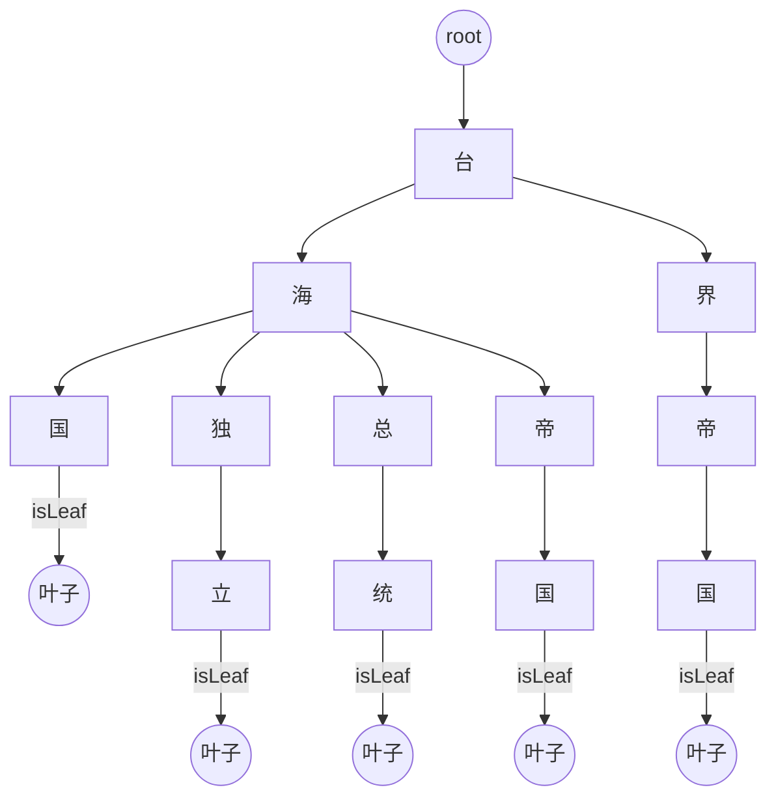
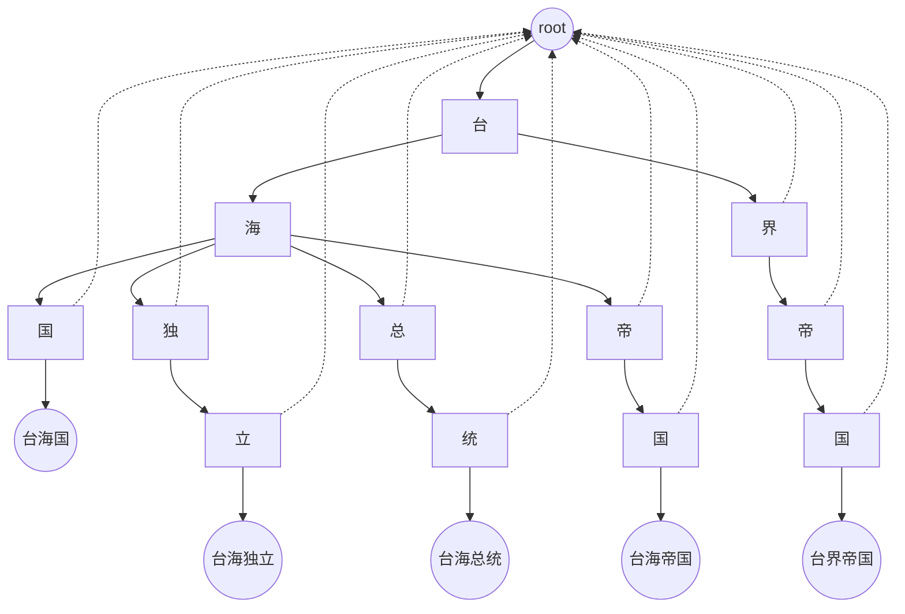
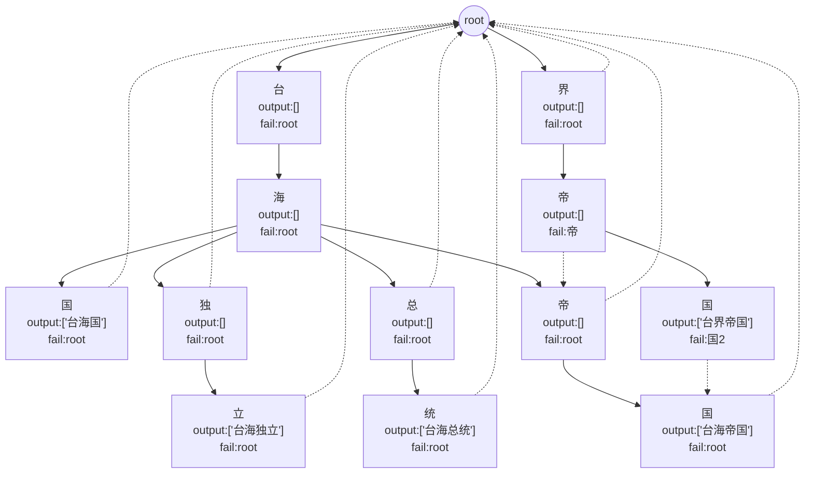
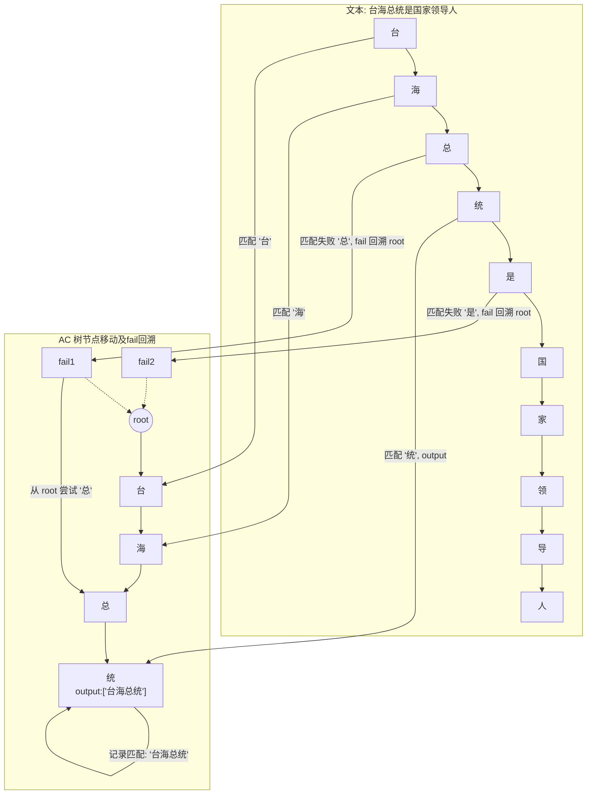
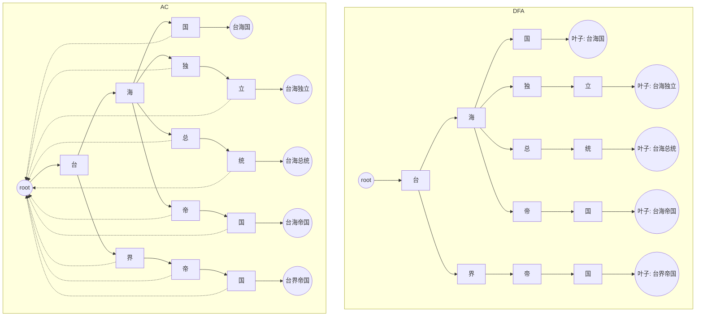
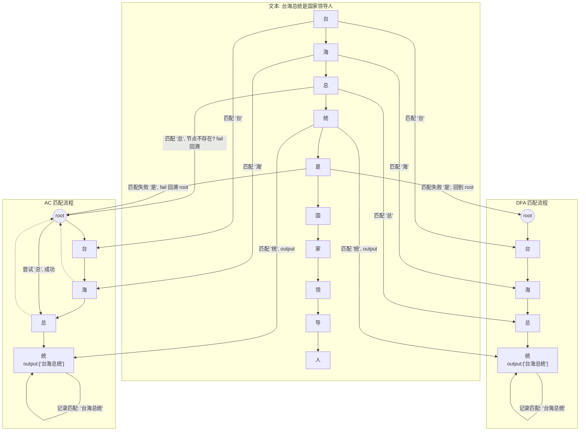

# AC与DFA树对比说明文档
本文档旨在帮助开发者理解 **DFA（Deterministic Finite Automaton，确定性有限自动机）** 与 **AC（Aho-Corasick）算法** 在敏感词匹配中的实现、原理及优劣势差异，并通过可视化示意图和动画流程展示两者的匹配机制。

## 算法简介
### DFA（确定性有限自动机）
- **原理**：构建一个完全基于字符路径的树（Trie 树），每条敏感词路径独立存储。
- **特点**：
    1. 匹配严格按照字符路径进行，不使用 fail 指针。
    2. 每次匹配失败都必须从根节点重新开始。
    3. 对重复字符或相同后缀的词无法复用节点，容易导致空间冗余。
- **适用场景**：词库较小、匹配逻辑简单、对匹配速度要求不高的场景。

### AC（Aho-Corasick）算法
- **原理**：在 DFA 树基础上增加 **fail 指针** 和 **output 列表**，支持快速回溯与多词匹配。
- **特点**：
    1. fail 指针指向最长公共后缀节点，匹配失败时不必回到 root。
    2. 节点 output 列表可存储多个敏感词，实现单次扫描匹配多词。
    3. 对重复字符或后缀共享节点，节省内存，提高效率。
- **适用场景**：敏感词库较大、文本匹配频繁、需支持多词匹配和高性能的场景。

## DFA 树示意图

### 说明
- DFA 不使用 fail 指针，只按字符路径匹配。
- 相同字符或后缀不会复用节点，例如 `"帝"` 在 `"台海帝国"` 与 `"台界帝国"` 中各自独立。
- 每个敏感词结尾节点单独标记 `isLeaf`。

## AC 树示意图
### 简单示意图


### 复杂完整示意图


### 说明
- 每个节点增加 `fail` 指针，指向最长公共后缀。
- 叶子节点 `output` 列表记录敏感词，实现多词匹配。
- 相同后缀或字符可复用 fail 指针，例如 `"台界帝国"` 的 fail 指向 `"台海帝国"`。


## AC（Aho-Corasick）算法的敏感词匹配流程
### AC 树构建回顾
AC 树由以下部分组成：
1. **节点 `children`**：表示字符路径。
2. **节点 `output`**：存储匹配到的敏感词（仅叶子节点可为空或非空）。
3. **节点 `fail`**：失败回溯指针，用于当匹配失败时，跳转到最长后缀节点继续匹配。

示例 AC 树简化结构如下：
```
root
├─台
│  ├─海
│  │  ├─国 (output: 台海国)
│  │  ├─独
│  │  │  └─立 (output: 台海独立)
│  │  ├─总
│  │  │  └─统 (output: 台海总统)
│  │  └─帝
│  │     └─国 (output: 台海帝国)
│  └─界
│     └─帝
│        └─国 (output: 台界帝国)
```

Fail 指针示意：

- `台海国.fail = root`
- `台海独立.fail = root`
- `台界帝国.fail = 台海帝国`（最长公共后缀“帝国”）

### 匹配流程核心思想
匹配文本 `"台海总统是国家领导人"`：

1. **初始化**：
    - 当前节点 `node = root`
    - 遍历文本每个字符 `r`
2. **按字符匹配**：

#### 步骤示例
| 文本索引 | 字符 | 当前节点            | 说明                                                         |
| -------- | ---- | ------------------- | ------------------------------------------------------------ |
| 0        | 台   | root → 台           | 找到 `台` 子节点，移动到 `台`                                |
| 1        | 海   | 台 → 海             | 找到 `海` 子节点，移动到 `海`                                |
| 2        | 总   | 海                  | `海` 没有 `总` 子节点 → 使用 fail 指针回溯到 root → root 没有 `总` → 匹配失败 → 重置到 root → 从当前位置继续 |
| 2        | 总   | root → 台 → 海 → 总 | 实际 AC 算法是从 fail 回溯，找到最长后缀匹配 → 这里海节点有总子节点，移动到总 |
| 3        | 统   | 总 → 统             | 找到子节点 → 节点 output = ["台海总统"] → 匹配到敏感词       |


### 匹配步骤总结
匹配时，AC 算法遵循以下规则：
1. **遍历文本字符 `c`**：
    - 如果 `node.children[c]` 存在 → 移动到该子节点。
    - 如果不存在 → `node = node.fail`（回溯到最长可匹配后缀），再尝试匹配。
    - 重复回溯直到 `node = root` 或找到匹配路径。
2. **遇到敏感词**：
    - 当前节点 `output` 非空 → 把 `output` 中所有词加入匹配结果。
    - 继续扫描下一个字符，匹配不会中断。
3. **效率优势**：
    - 相比 DFA，AC 不会每次匹配失败都回到 root，而是通过 fail 指针快速回溯。
    - 可以同时匹配多个敏感词（节点 output 可存储多个词）。

### 示例：匹配 "台海总统" 流程
1. `node = root`
2. 遇到 `'台'` → 移动到 `台`
3. 遇到 `'海'` → 移动到 `海`
4. 遇到 `'总'` → 移动到 `总`
5. 遇到 `'统'` → 移动到 `统` → `output = ["台海总统"]` → 匹配到敏感词
6. 继续扫描下一个字符 → 若当前节点没有对应子节点 → fail 指针回溯

### AC 匹配流程动画版


#### AC匹配流程动画版特点
1. **文本扫描**：上方水平排列，按索引从左到右扫描每个字符。
2. **AC 树节点**：垂直展示节点路径（台 → 海 → 总 → 统）。
3. **匹配过程**：
    - 箭头表示从文本字符到 AC 树节点的匹配。
    - 失败时通过虚线箭头 fail 回溯到 root。
    - 到达叶子节点或 output 非空节点时，记录匹配敏感词。
4. **动画效果**（概念）：
    - 每扫描一个字符 → 节点高亮 → 匹配/回溯 → 输出结果。
    - 可以直观看到 AC 算法如何利用 fail 指针避免重复扫描。

#### 总结
- AC 匹配的核心就是 **字符路径 + fail 指针 + output 列表**。
- 匹配流程保证：
    1. 每次匹配失败不用回到 root，而是跳到最长公共后缀。
    2. 可以在单次扫描中匹配多个敏感词。
    3. 输出列表允许同时匹配重叠敏感词（例如 `"台海帝国"` 和 `"帝国"`）。

## DFA 与 AC 树对比图


### 对比说明
| 特性      | DFA                       | AC（Aho-Corasick）           |
| --------- | ------------------------- | ---------------------------- |
| 路径复用  | 无，重复字符/后缀独立节点 | 有，相同后缀可复用 fail 指针 |
| fail 指针 | 无                        | 有，匹配失败快速回溯         |
| 匹配效率  | 匹配失败回 root，效率低   | fail 指针减少回溯，效率高    |
| 多词匹配  | 不支持                    | 支持，output 列表存储多个词  |

## AC vs DFA 匹配动画对比图

### AC vs DFA 匹配动画对比图特点
1. **DFA 匹配**：
    - 匹配失败必须 **回到 root**，然后从当前位置重新尝试。
    - 对于 `"是"`，DFA 需要回到 root，因此回溯次数较多。
2. **AC 匹配**：
    - 有 **fail 指针**，匹配失败不需要回到 root，直接跳到合适节点继续匹配。
    - 对于 `"总"` 和 `"是"`，AC 能利用 fail 指针减少回溯，匹配效率更高。
3. **动画箭头**：
    - 表示文本扫描过程中每个字符与树节点的匹配尝试。
    - output 节点表示敏感词匹配成功。

## 总结
- DFA：
  - 简单直观，易于实现。
  - 路径独立，空间冗余大。
  - 匹配效率低，尤其是词库大时。
- AC：
  - 基于 DFA 增加 fail 指针和 output 列表。
  - 支持多词匹配和重叠词匹配。
  - 匹配失败回溯快，效率高，尤其适合大词库和高频文本匹配场景。

> **开发者建议**：
> - 小型敏感词库，可使用 DFA 实现简单匹配。
> - 大型敏感词库、文本量大、需高效匹配，推荐使用 AC 算法。