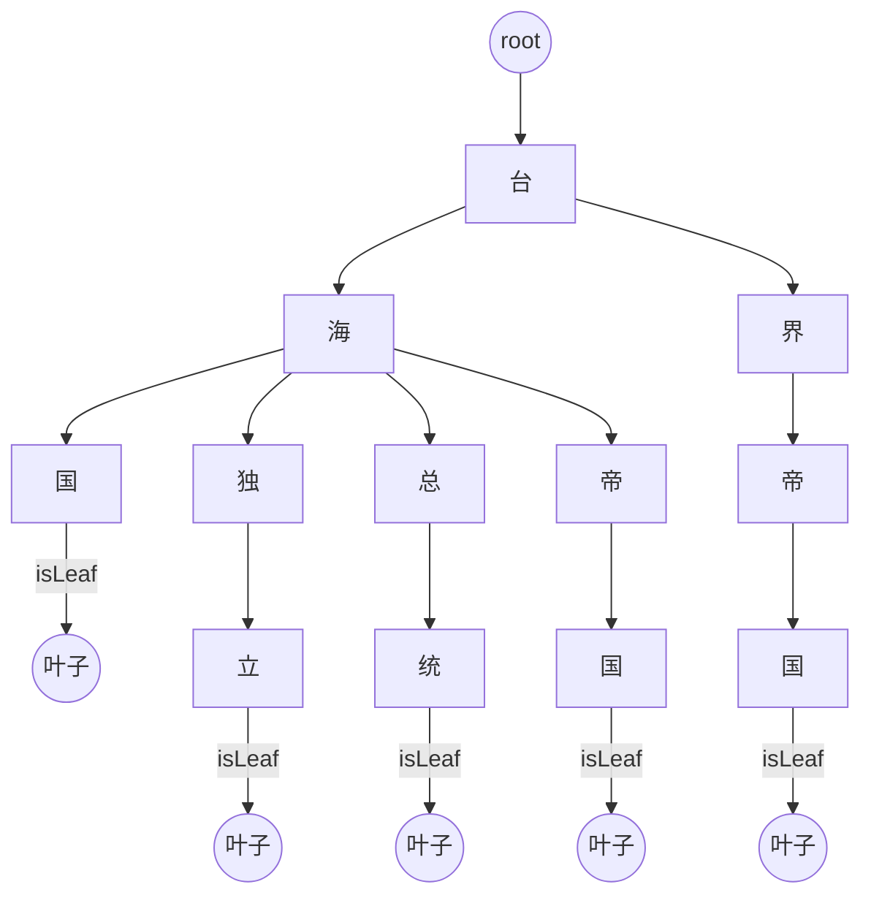
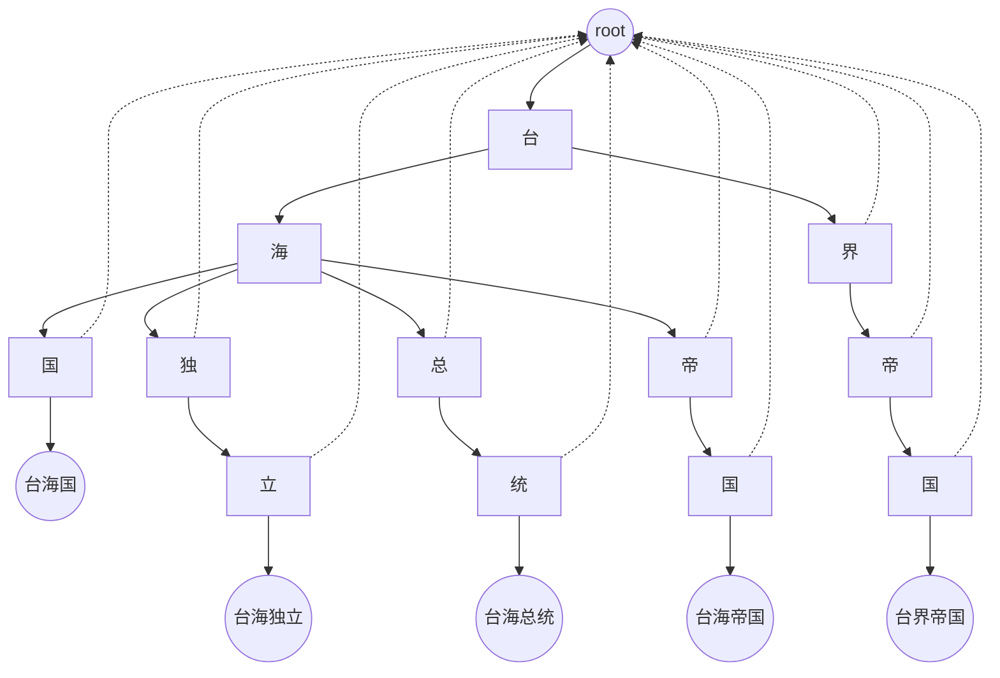
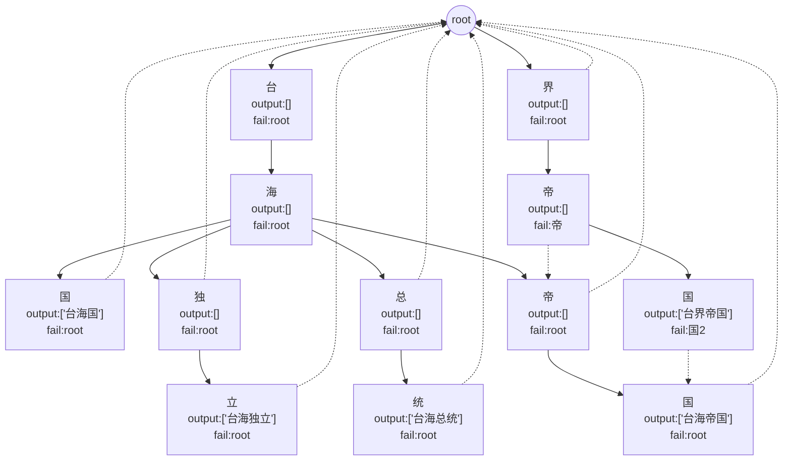
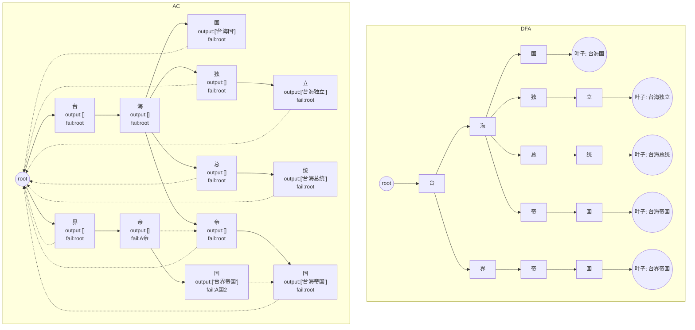
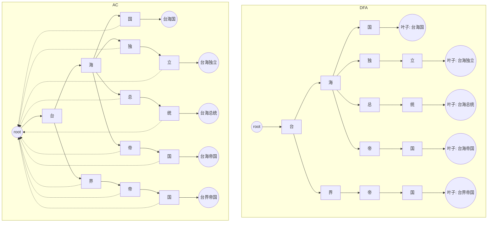

# DFA 与 AC 树对比说明文档

## DFA 树示意图

### 说明
- DFA 不使用 fail 指针，只按字符路径匹配。
- “帝” 节点在 “台海帝国” 和 “台界帝国” 中并没有复用，因为两条路径分支不同。
- 每个词尾单独标记isLeaf为结束。

## AC 树示意图



## AC 树完整示意图


### 说明：
- AC 树会在构建 fail 指针时，把相同后缀的节点链接到公共路径，支持同时匹配多个词。
- 每个叶子节点 output 列表中存储匹配的敏感词。

## DFA 与 AC 树对比图


### 例图说明：
1. 每个节点标注：
    - `output`：该节点匹配到的敏感词列表
    - `fail`：fail 指针回溯目标
2. 虚线箭头表示 fail 指针，用于多词匹配的回溯。
3. 节点之间路径按字符顺序构建，叶子节点存储完整敏感词。

### AC（Aho-Corasick）算法的敏感词匹配流程
#### AC 树构建回顾
AC 树由以下部分组成：
1. **节点 `children`**：表示字符路径。
2. **节点 `output`**：存储匹配到的敏感词（仅叶子节点可为空或非空）。
3. **节点 `fail`**：失败回溯指针，用于当匹配失败时，跳转到最长后缀节点继续匹配。

示例 AC 树简化结构如下：
```
root
├─台
│  ├─海
│  │  ├─国 (output: 台海国)
│  │  ├─独
│  │  │  └─立 (output: 台海独立)
│  │  ├─总
│  │  │  └─统 (output: 台海总统)
│  │  └─帝
│  │     └─国 (output: 台海帝国)
│  └─界
│     └─帝
│        └─国 (output: 台界帝国)
```

Fail 指针示意：

- `台海国.fail = root`
- `台海独立.fail = root`
- `台界帝国.fail = 台海帝国`（最长公共后缀“帝国”）

#### 匹配流程核心思想
匹配文本 `"台海总统是国家领导人"`：

1. **初始化**：
    - 当前节点 `node = root`
    - 遍历文本每个字符 `r`
2. **按字符匹配**：

##### 步骤示例
| 文本索引 | 字符 | 当前节点            | 说明                                                         |
| -------- | ---- | ------------------- | ------------------------------------------------------------ |
| 0        | 台   | root → 台           | 找到 `台` 子节点，移动到 `台`                                |
| 1        | 海   | 台 → 海             | 找到 `海` 子节点，移动到 `海`                                |
| 2        | 总   | 海                  | `海` 没有 `总` 子节点 → 使用 fail 指针回溯到 root → root 没有 `总` → 匹配失败 → 重置到 root → 从当前位置继续 |
| 2        | 总   | root → 台 → 海 → 总 | 实际 AC 算法是从 fail 回溯，找到最长后缀匹配 → 这里海节点有总子节点，移动到总 |
| 3        | 统   | 总 → 统             | 找到子节点 → 节点 output = ["台海总统"] → 匹配到敏感词       |


#### 匹配步骤总结
匹配时，AC 算法遵循以下规则：
1. **遍历文本字符 `c`**：
    - 如果 `node.children[c]` 存在 → 移动到该子节点。
    - 如果不存在 → `node = node.fail`（回溯到最长可匹配后缀），再尝试匹配。
    - 重复回溯直到 `node = root` 或找到匹配路径。
2. **遇到敏感词**：
    - 当前节点 `output` 非空 → 把 `output` 中所有词加入匹配结果。
    - 继续扫描下一个字符，匹配不会中断。
3. **效率优势**：
    - 相比 DFA，AC 不会每次匹配失败都回到 root，而是通过 fail 指针快速回溯。
    - 可以同时匹配多个敏感词（节点 output 可存储多个词）。

#### 示例：匹配 "台海总统" 流程
1. `node = root`
2. 遇到 `'台'` → 移动到 `台`
3. 遇到 `'海'` → 移动到 `海`
4. 遇到 `'总'` → 移动到 `总`
5. 遇到 `'统'` → 移动到 `统` → `output = ["台海总统"]` → 匹配到敏感词
6. 继续扫描下一个字符 → 若当前节点没有对应子节点 → fail 指针回溯

#### 总结
- AC 匹配的核心就是 **字符路径 + fail 指针 + output 列表**。
- 匹配流程保证：
    1. 每次匹配失败不用回到 root，而是跳到最长公共后缀。
    2. 可以在单次扫描中匹配多个敏感词。
    3. 输出列表允许同时匹配重叠敏感词（例如 `"台海帝国"` 和 `"帝国"`）。

    

## DFA 与 AC 树对比图


### 对比说明
1. 路径复用：
    - DFA 中每条词路径完全独立，重复字符没有共享节点（如“帝”在两条路径中重复）。
    - AC 中相同后缀或字符可复用 fail 指针（如“帝”节点在台海帝国和台界帝国之间通过 fail 回溯）。
2. fail 指针：
    - AC 用 fail 快速回溯，支持多词同时匹配，提高匹配效率。
    - DFA 没有 fail 指针，每次匹配失败都从根节点重新开始。
3. 匹配效率：
    - DFA 在匹配长文本时，每次失败都要回到根节点，效率较低。
    - AC 利用 fail 指针可以跳过不必要的匹配，整体效率更高。