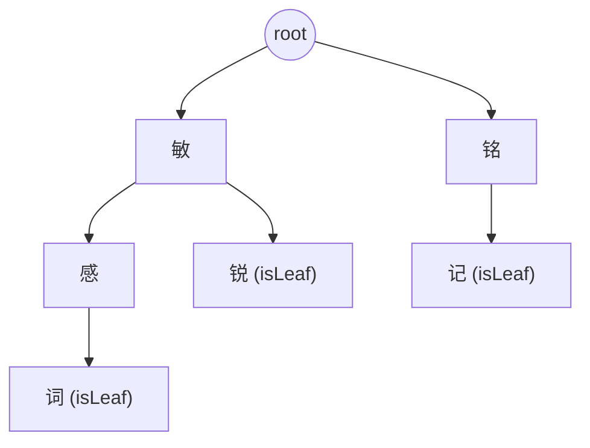
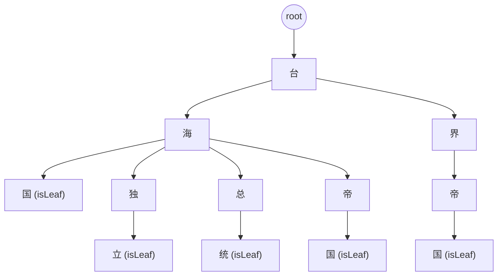

# DFA 算法实现代码详解
## 基本思想
- 前缀树（Trie）/基于 DFA 思想的多模式匹配器：将敏感词逐字符插入到树中（节点以 rune 为边），匹配时从文本的每个起点开始沿树向下扫描，检测是否存在敏感词。

- 与 Aho-Corasick 算法的区别
  - Aho-Corasick 在 Trie 的基础上增加 **failure 链**，实现整体文本的线性扫描，复杂度 O(n + totalPatternLength)。
  - 本实现采用 **逐起点尝试匹配** 的方式，最坏情况下复杂度可能达到 O(n × m)。
  - 优点：逻辑直观，实现简单，插入与查询容易理解。

## 数据结构与代码映射
```go
type dfaNode struct {
    children map[rune]*dfaNode
    isLeaf   bool
}

type DfaModel struct {
    root *dfaNode
}
```

- **children map[rune]dfaNode*：以字符为边，存储当前节点的所有子节点。
- **isLeaf bool**：标记从 root 到当前节点的路径是否构成一个完整敏感词。
- **root**：空前缀状态，所有匹配从这里开始。

> ⚠️ 注意：相同字符在不同父路径下会对应不同 dfaNode 实例（路径唯一决定节点），不会全局复用。

## 构建过程（AddWord / AddWords）
### 插入流程
1. 将敏感词转换为 []rune（支持多字节字符）。
2. 从 root 出发：
   - 若当前字符已存在子节点，沿该节点前进；
   - 否则新建子节点并连接。
3. 遍历结束后，将最后节点标记为 isLeaf = true。

### **时间与空间复杂度**
- 时间复杂度：O(L)（L 为词长）
- 空间复杂度：新增节点数约等于新增字符数，共享前缀可节省空间

### **可视化示例**


## DFA 节点树示例
示例词集合："台海国"、"台海独立"、"台海总统"、"台海帝国"、"台界帝国"



说明：
- 图中有多个“国”节点（台->海->国、海->国、海->帝->国），它们是不同的 dfaNode 实例。
- 本实现按路径组织节点，并未进行全局字符复用。

## DFA 匹配逻辑
匹配方法包括：FindAll、FindAllCount、FindOne、IsSensitive、Replace、Remove。
它们基于相同的 **逐起点扫描逻辑**，以 FindAll 为例说明。

### 核心变量
- runes：输入文本转为 []rune
- start：当前起点索引
- pos：当前扫描位置
- parent：Trie 中当前节点（起点时为 root）
- now：当前字符对应的子节点

### 搜索伪代码
```go
start: = 0
parent: = root
for pos: = 0; pos < length; pos++{
    now, found = parent.children[runes[pos]]
    if !found {
        // 当前路径没有继续，重置为新的起点
        parent = root
        pos = start // 重置 pos 为 start（注意：后续循环会再自动 pos++）
        start++
        continue
    }
    
    // 找到子节点
    if now.isLeaf && start <= pos {
        // 在 [start,pos] 区间上匹配到一个完整敏感词
        record match runes[start: pos + 1]
    }
    
    if pos == length - 1 {
        // 到达文本末尾，重置以便从下一个起点开始
        parent = root
        pos = start
        start++
        continue
    }
    
    // 继续沿 Trie 向下匹配
    parent = now
}
```

### 控制流要点
- 未找到匹配时，parent 重置为 root，并将 pos = start, start++
- 下一轮循环 pos++ 正好移动到下一个起点
- 整体效果：对每个起点尽可能延长匹配，失败则向后滑动一位

## 方法差异
| **方法**     | **行为**                             |
| ------------ | ------------------------------------ |
| FindOne      | 匹配到第一个敏感词立即返回           |
| FindAll      | 收集所有匹配结果，去重后返回         |
| FindAllCount | 统计匹配结果出现次数                 |
| IsSensitive  | 基于 FindOne 判断文本是否含敏感词    |
| Replace      | 将命中的敏感词用指定符号（如 *）替换 |
| Remove       | 删除匹配的敏感词，返回净化后的文本   |


## 示例：FindAll 执行过程
敏感词：["敏锐", "敏感词", "铭记"]

文本："我们要铭记敏锐的观察和敏感词出现"
- 从 "铭" 开始匹配到 "铭记"
- 继续扫描，匹配到 "敏锐"
- 再次匹配到 "敏感词"
- 返回结果：["铭记", "敏锐", "敏感词"]（顺序可能随实现而异）

## 复杂度分析
- 构建（AddWord）
  - 时间复杂度：O(L)
  - 空间复杂度：与总词长相关（共享前缀节省空间）
- 匹配（FindAll 等）
  - 本实现最坏复杂度：O(n × m)（n = 文本长度，m = 最大敏感词长度）
  - Aho-Corasick：通过 failure 链实现线性复杂度 O(n + totalPatternLength)

## 总结
- 本实现基于 Trie 的 DFA 思想
- 优点：逻辑清晰、易于理解和实现
- 缺点：匹配效率在大规模词库时不如 Aho-Corasick
- 适用场景：中小规模敏感词过滤；大规模场景建议优化为 Aho-Corasick

