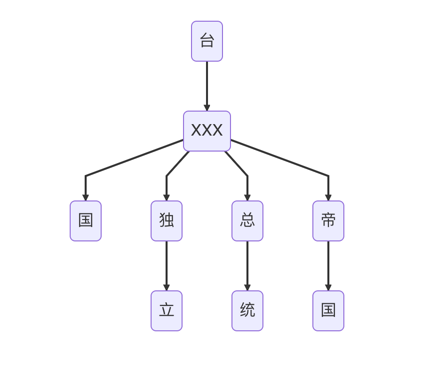
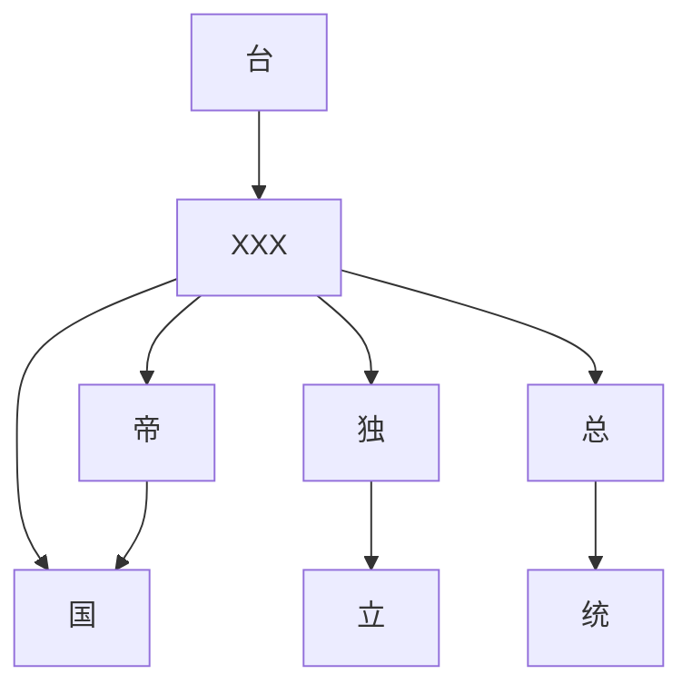

#  DFA 算法实现敏感词过滤

敏感词过滤是很多应用中必不可少的功能之一，它能够有效地防止用户输入或发布敏感内容，维护良好的网络环境。在本文中，我们将详细讨论如何通过 DFA（Deterministic Finite Automaton）算法实现敏感词的过滤逻辑。

## 敏感词过滤器的组成部分
我们的敏感词过滤器主要由两个核心部分组成：敏感词库的存储和 DFA 模型的构建与匹配。让我们先来了解这两个部分的作用：

- **敏感词库存储（Store）：** 敏感词库用于存储所有的敏感词，它可以从本地文件、远程服务器或者其他来源加载敏感词，并提供添加、删除和查询敏感词的功能。
- **DFA 模型（Filter）：** DFA 模型是敏感词过滤的核心算法，它根据敏感词库构建出一个有限状态自动机，用于高效地检测文本中是否包含敏感词。

## DFA 模型的构建过程
### 构建 DFA 节点树
首先，我们需要构建一个 DFA 节点树，该树的根节点代表初始状态，每个节点代表一个状态，节点之间的边表示状态之间的转移。对于敏感词过滤器来说，节点树的构建过程如下：

- 创建根节点，初始化为非叶子节点。
- 逐个读取敏感词，对于每个敏感词，从根节点开始，根据敏感词的每个字符构建子节点，直到敏感词的最后一个字符。在构建节点的过程中，需要注意如果已存在当前字符的节点，则直接跳转到该节点，否则创建新节点。
- 将敏感词的最后一个字符所对应的节点标记为叶子节点，表示敏感词的结束。

### DFA 节点树示意图
以敏感词 「敏感词」、「敏锐」 和 「铭记」 为例，构建 DFA 节点树如下：
```markdown
根节点
|
|-- '敏' -- '感' -- '词' (叶子节点)
|       |
|       '-- '锐' (叶子节点)
|
|-- '铭' -- '记' (叶子节点)
```
这里：
- "敏感词" 路径是 根 → ‘敏’ → ‘感’ → ‘词’；
- "敏锐" 路径是 根 → ‘敏’ → ‘锐’；
- "铭记" 路径是 根 → ‘铭’ → ‘记’。

下面的逻辑图演示敏感词库多条字词形成的 DFA 节点树思维图。





## DFA 模型的匹配逻辑
构建好 DFA 节点树后，我们可以利用该模型对文本进行敏感词的匹配，匹配过程如下：

- 从文本的第一个字符开始，根据字符在 DFA 节点树中的转移，逐步遍历整个文本。
- 如果当前字符在节点树中找不到对应的转移，则回到根节点重新开始匹配下一个字符。
- 如果匹配到叶子节点，则表示找到了一个敏感词，记录下该敏感词并继续匹配。
- 当匹配完成整个文本后，返回所有匹配到的敏感词列表。

## 实现细节
在实际的代码实现中，我们需要考虑以下几个方面：

- 敏感词的存储和加载：可以从文件、数据库或者远程接口加载敏感词。
- DFA 节点树的构建：需要设计合适的数据结构来表示节点树，并实现节点的添加和删除操作。
- DFA 模型的匹配逻辑：根据节点树进行文本的匹配，并返回匹配结果。

