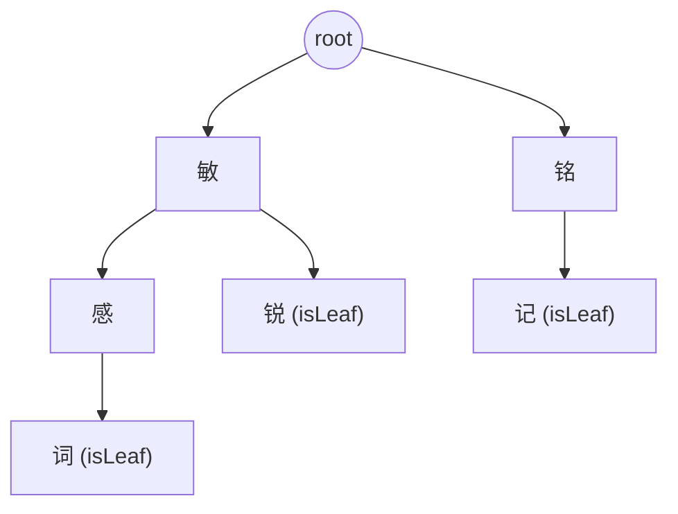
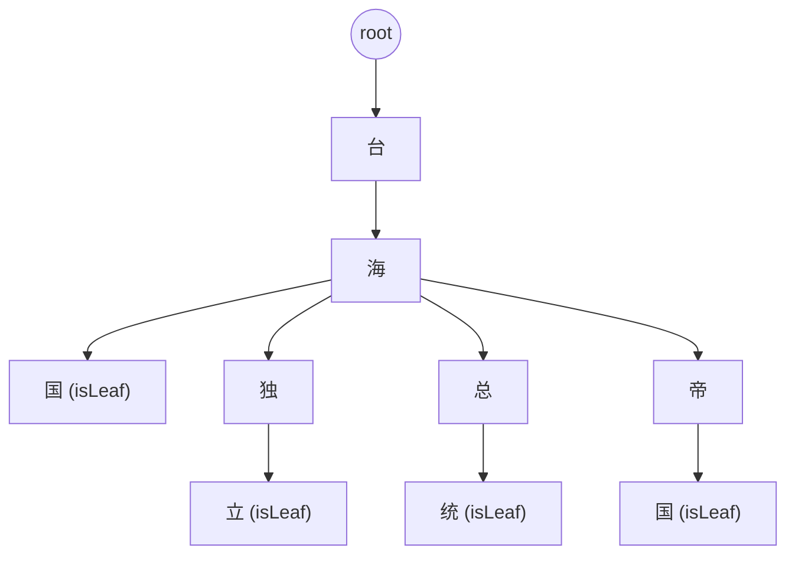

# DFA 算法实现敏感词过滤（基于 trie 的实现）
敏感词过滤是很多应用中必不可少的功能之一，用于防止敏感或不当内容的出现。本文档介绍基于 DFA（更准确说是 trie）的敏感词过滤实现、构建流程、匹配逻辑、示意图以及实现细节与注意点。文档贴合已有代码实现，包含行为细节与边界说明，便于开发者正确使用和扩展。

## 组成部分
- 敏感词库存储（Store）：保存所有敏感词，可从文件、数据库或远程接口加载；提供添加、删除功能。
- DFA 模型（Filter）：用 `trie`（树）结构存储敏感词并完成匹配与处理；每个节点用 `children map[rune]*dfaNode` 表示子节点，用 `isLeaf` bool 标记词尾。

## DFA 模型的构建过程
- 初始化：创建根节点 `root`（非叶子）。
- 将词转换为 `rune` 切片：支持多字节字符（中文、emoji 等）。
- 逐字符构建 / 复用节点：
  - 从 `root` 开始遍历词的每个字符 `r`：
  - 若 `current.children[r]` 存在，则沿此子节点下行；
  - 否则创建新节点并链接到 `current.children[r]`。
- 标记词尾：遍历完一个词后，将当前节点 `isLeaf = true`。
- 批量添加：对多个词重复该过程（共享前缀的词会复用节点）。

构建复杂度：插入每个词时间 `O(L)`（L 为词长度），总空间与所有词字符总数相关（共享前缀会共享节点）。

## 节点树示意图
### 简单示例
下面图示展示了含有 ["敏感词","敏锐","铭记"] 的 DFA（trie）树结构：

说明：每条路径 root -> ... -> (isLeaf) 表示一个敏感词。相同字符在不同路径下对应不同节点实例（节点按路径唯一）。

### 复杂示例（多条词形成的 DFA 思维图）
示例词集合："台海"、"台海国"、"海国"、"海独立"、"海总统"、"海帝国"，展示 国 在不同父节点下为独立节点的事实：
示例词集合："台海国"、"台海独立"、"台海总统"、"台海帝国"，展示 国 在不同父节点下为独立节点的事实：

要点：`国` 虽然是同一字符，但在 `trie` 中依赖父节点而存在多个不同节点实例（即 `国` 并非全局唯一节点）。

## 匹配逻辑
**总体思路**：按文本中的每个起点 start 向下沿 trie 尝试匹配，若在某位置遇到 isLeaf 则记录匹配；若在某字符处无法继续匹配，则把起点向右滑动一个位置重试（即 start++）。

- 从文本的第一个字符开始，根据字符在 `DFA` 节点树中的转移，逐步遍历整个文本。
- 如果当前字符在节点树中找不到对应的转移，则回到根节点重新开始匹配下一个字符。
- 如果匹配到叶子节点，则表示找到了一个敏感词，记录下该敏感词并继续匹配。
- 当匹配完成整个文本后，返回所有匹配到的敏感词列表。

### 匹配复杂度
- 当前实现是“按起点滑动并尝试最长匹配”的 `trie` 扫描，最坏时间复杂度可能达到 `O(n * m)`（n 文本长度，m 敏感词最大长度）。
- 若需要严格线性时间，可以考虑 `Aho-Corasick` 的 `failure-link` 扩展

