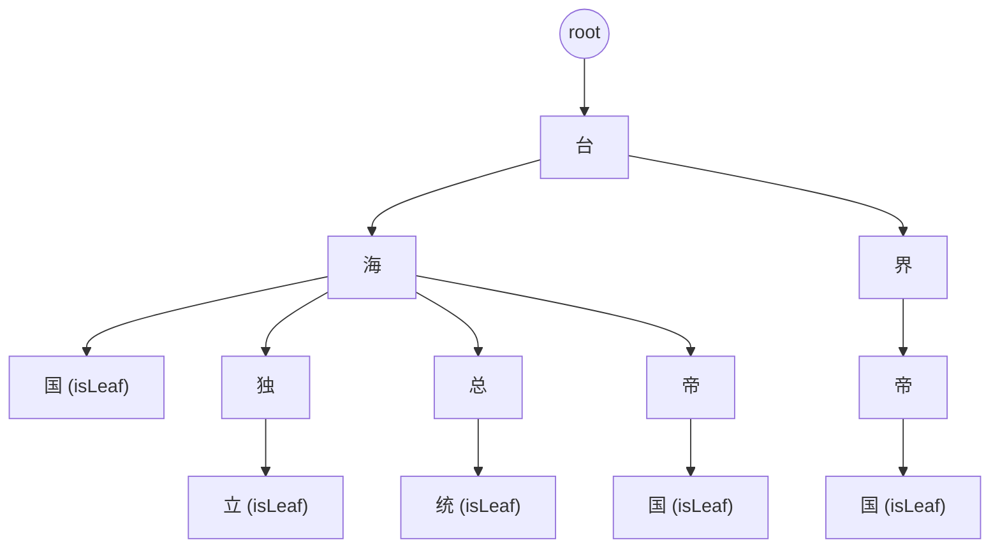

# DFA 算法实现敏感词过滤（基于 Trie 的实现）

敏感词过滤是许多应用中必不可少的功能，用于防止敏感或不当内容的出现。本文档介绍基于 Trie（前缀树）的敏感词过滤实现（借鉴 DFA 思想），包括构建流程、匹配逻辑、示意图、实现细节与注意点。文档贴合已有 Go 语言代码实现，包含行为细节、边界说明以及与 Aho-Corasick 算法的比较，便于开发者正确使用和扩展。

## 基本思想
- **Trie/DFA 思想的多模式匹配**：将敏感词逐字符插入到树中（以 rune 为边），匹配时从文本的每个起点开始沿树向下扫描，检测是否存在敏感词。
- **与 Aho-Corasick 的区别**：
    - Aho-Corasick 在 Trie 的基础上增加 **failure 链**，实现整体文本的线性扫描，复杂度 O(n + totalPatternLength)。
    - 本实现采用 **逐起点尝试匹配** 的方式，最坏情况下复杂度可能达到 O(n × m)（n 为文本长度，m 为敏感词最大长度）。
    - 优点：逻辑直观，实现简单，插入与查询容易理解。
- **适用场景**：中小规模敏感词过滤；大规模场景建议优化为 Aho-Corasick。

## 组成部分
- **敏感词库存储（Store）**：保存所有敏感词，可从文件、数据库或远程接口加载；提供添加、删除功能。
- **DFA 模型（Filter）**：用 Trie 结构存储敏感词并完成匹配与处理；每个节点用 `children map[rune]*dfaNode` 表示子节点，用 `isLeaf` bool 标记词尾。

## 数据结构
```go
type dfaNode struct {
    children map[rune]*dfaNode
    isLeaf   bool
}

type DfaModel struct {
    root *dfaNode
}
```
- **children map[rune]*dfaNode**：以字符为边，存储当前节点的所有子节点。
- **isLeaf bool**：标记从 root 到当前节点的路径是否构成一个完整敏感词。
- **root**：空前缀状态，所有匹配从这里开始。
- ⚠️ 注意：相同字符在不同父路径下会对应不同 dfaNode 实例（路径唯一决定节点），不会全局复用。

## 构建过程（AddWord / AddWords）
- **初始化**：创建根节点 `root`（非叶子）。
- **插入流程**：
    1. 将敏感词转换为 []rune（支持多字节字符，如中文、emoji）。
    2. 从 root 出发：
        - 若当前字符已存在子节点，沿该节点前进；
        - 否则新建子节点并连接。
    3. 遍历结束后，将最后节点标记为 isLeaf = true。
- **批量添加**：对多个词重复该过程（共享前缀的词会复用节点）。
- **时间与空间复杂度**：
    - 时间：O(L)（L 为词长）。
    - 空间：新增节点数约等于新增字符数，共享前缀可节省空间；总空间与所有词字符总数相关。

## 节点树示意图
### 简单示例
敏感词："敏感词"、"敏锐"、"铭记"

说明：每条路径 root -> ... -> (isLeaf) 表示一个敏感词。相同字符在不同路径下对应不同节点实例。

### 复杂示例
敏感词："台海国"、"台海独立"、"台海总统"、"台海帝国"、"台界帝国"

要点：`国` 虽然是同一字符，但在 Trie 中依赖父节点而存在多个不同节点实例（并非全局唯一）。

## 匹配逻辑
**总体思路**：按文本中的每个起点 start 向下沿 Trie 尝试匹配，若在某位置遇到 isLeaf 则记录匹配；若在某字符处无法继续匹配，则把起点向右滑动一个位置重试（即 start++）。从文本的第一个字符开始，根据字符在 Trie 中的转移，逐步遍历整个文本。如果当前字符找不到对应的转移，则回到根节点重新开始匹配下一个字符。如果匹配到叶子节点，则表示找到了一个敏感词，记录下该敏感词并继续匹配。当匹配完成整个文本后，返回所有匹配到的敏感词列表。

### 核心变量
- runes：输入文本转为 []rune
- start：当前起点索引
- pos：当前扫描位置
- parent：Trie 中当前节点（起点时为 root）
- now：当前字符对应的子节点

### 搜索伪代码（以 FindAll 为例）
```go
start := 0
parent := root
for pos := 0; pos < length; pos++ {
    now, found = parent.children[runes[pos]]
    if !found {
        // 当前路径没有继续，重置为新的起点
        parent = root
        pos = start // 重置 pos 为 start（注意：后续循环会再自动 pos++）
        start++
        continue
    }
    
    // 找到子节点
    if now.isLeaf && start <= pos {
        // 在 [start, pos] 区间上匹配到一个完整敏感词
        record match runes[start: pos + 1]
    }
    
    if pos == length - 1 {
        // 到达文本末尾，重置以便从下一个起点开始
        parent = root
        pos = start
        start++
        continue
    }
    
    // 继续沿 Trie 向下匹配
    parent = now
}
```
- **控制流要点**：未找到匹配时，parent 重置为 root，并将 pos = start, start++；下一轮循环 pos++ 正好移动到下一个起点。整体效果：对每个起点尽可能延长匹配，失败则向后滑动一位。

### 匹配复杂度
- 本实现最坏时间复杂度：O(n × m)（n 文本长度，m 敏感词最大长度）。
- 若需要严格线性时间，可扩展为 Aho-Corasick 的 failure-link。

## 示例：FindAll 执行过程
敏感词：["敏锐", "敏感词", "铭记"]

文本："我们要铭记敏锐的观察和敏感词出现"
- 从 "铭" 开始匹配到 "铭记"
- 继续扫描，匹配到 "敏锐"
- 再次匹配到 "敏感词"
- 返回结果：["铭记", "敏锐", "敏感词"]（顺序可能随实现而异）

## 复杂度分析
- **构建（AddWord）**：
    - 时间：O(L)
    - 空间：与总词长相关（共享前缀节省空间）
- **匹配（FindAll 等）**：
    - 最坏：O(n × m)
    - Aho-Corasick：O(n + totalPatternLength)

## 总结
- 本实现基于 Trie 的 DFA 思想，逻辑清晰、易于理解和实现。
- 缺点：匹配效率在大规模词库时不如 Aho-Corasick。
- 扩展建议：添加 failure 链以优化性能；支持更多字符类型和动态词库更新。