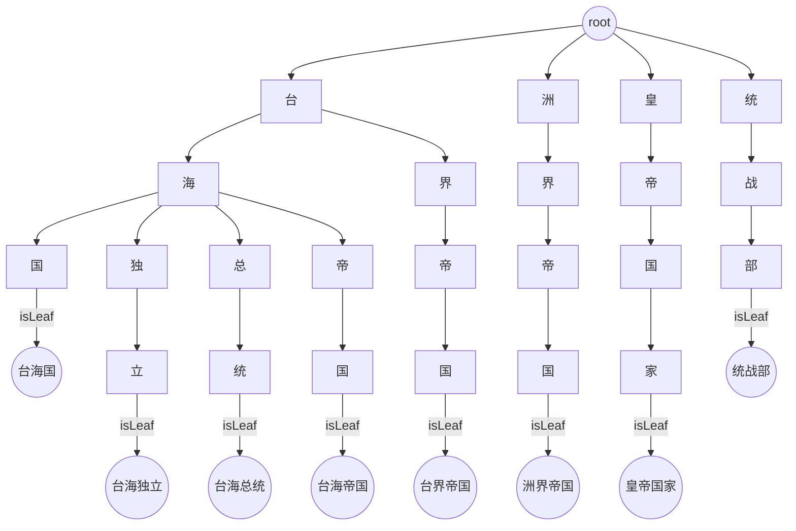
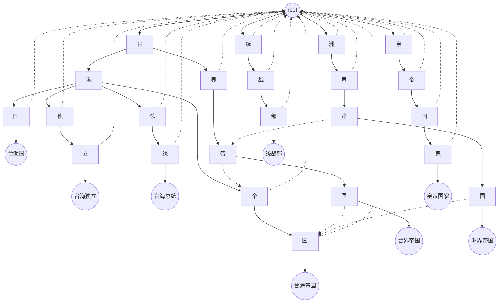
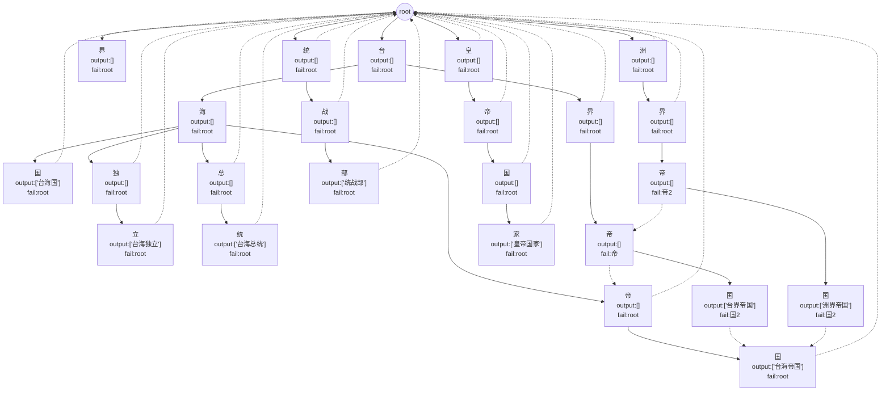
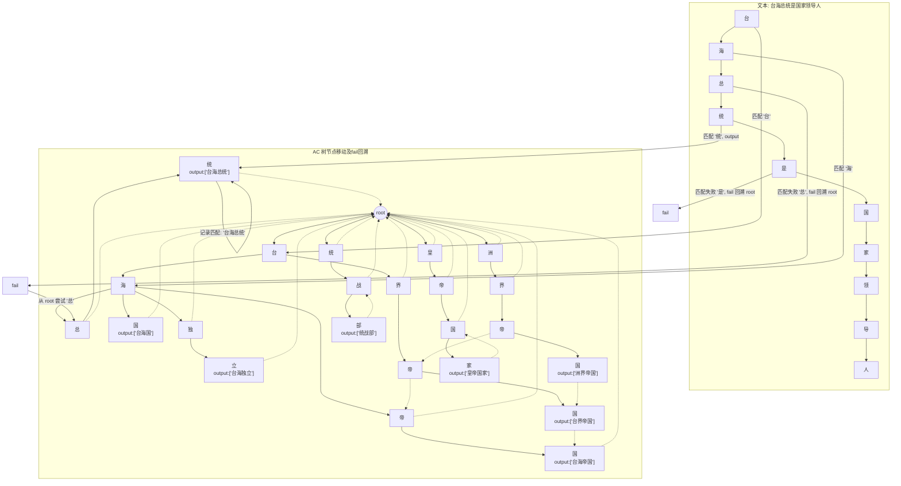
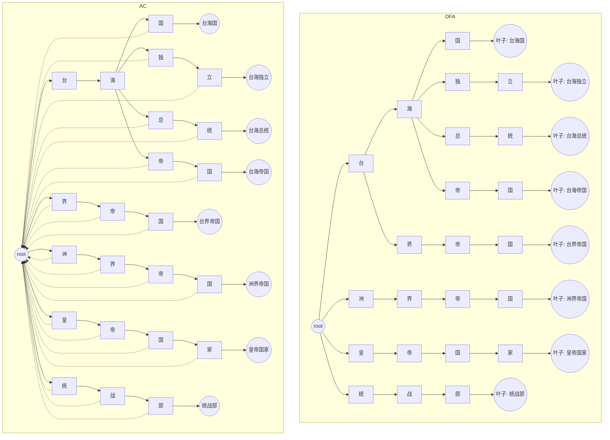

# 多分支敏感词对比图
```
敏感词："台海国"、"台海独立"、"台海总统"、"台海帝国"、"台界帝国"、"洲界帝国"、"皇帝国家"、"统战部"
```

## DFA 树示意图




## AC 树示意图

### 简单示意图



### 复杂完整示意图



## AC（Aho-Corasick）算法的敏感词匹配流程

示例 AC 树简化结构如下：

```
root
├─台
│  ├─海
│  │  ├─国       (output: 台海国)
│  │  ├─独
│  │  │  └─立   (output: 台海独立)
│  │  ├─总
│  │  │  └─统   (output: 台海总统)
│  │  └─帝
│  │     └─国   (output: 台海帝国)
│  └─界
│     └─帝
│        └─国   (output: 台界帝国)
├─洲
│  └─界
│     └─帝
│        └─国   (output: 洲界帝国)
├─皇
│  └─帝
│     └─国
│        └─家   (output: 皇帝国家)
└─统
   └─战
      └─部       (output: 统战部)
```

### AC 匹配流程动画版



## DFA 与 AC 树对比图



## AC vs DFA 匹配动画对比图

```mermaid
flowchart TB
    %% 文本扫描
    subgraph 文本["文本: 台海总统是国家领导人"]
        direction LR
        T0["台"] --> T1["海"] --> T2["总"] --> T3["统"] --> T4["是"] --> T5["国"] --> T6["家"] --> T7["领"] --> T8["导"] --> T9["人"]
    end

    %% DFA 匹配流程
    subgraph DFA["DFA 匹配流程"]
        direction TB
        DRoot((root))
        D台["台"] 
        D海["海"]
        D国["国\noutput:['台海国']"]
        D独["独"]
        D立["立\noutput:['台海独立']"]
        D总["总"]
        D统["统\noutput:['台海总统']"]
        D帝["帝"]
        D国2["国\noutput:['台海帝国']"]
        D界["界"]
        D帝2["帝"]
        D国3["国\noutput:['台界帝国']"]
        D洲["洲"]
        D界2["界"]
        D帝3["帝"]
        D国4["国\noutput:['洲界帝国']"]
        D皇["皇"]
        D帝4["帝"]
        D国5["国"]
        D家["家\noutput:['皇帝国家']"]
        D统2["统"]
        D战["战"]
        D部["部\noutput:['统战部']"]

        %% 树结构
        DRoot --> D台
        DRoot --> D界
        DRoot --> D洲
        DRoot --> D皇
        DRoot --> D统2

        D台 --> D海
        D海 --> D国
        D海 --> D独
        D独 --> D立
        D海 --> D总
        D总 --> D统
        D海 --> D帝
        D帝 --> D国2

        D界 --> D帝2
        D帝2 --> D国3

        D洲 --> D界2
        D界2 --> D帝3
        D帝3 --> D国4

        D皇 --> D帝4
        D帝4 --> D国5
        D国5 --> D家

        D统2 --> D战
        D战 --> D部
    end

    %% AC 匹配流程
    subgraph AC["AC 匹配流程"]
        direction TB
        ARoot((root))
        A台["台"] 
        A海["海"]
        A国["国\noutput:['台海国']"]
        A独["独"] 
        A立["立\noutput:['台海独立']"]
        A总["总"]
        A统["统\noutput:['台海总统']"]
        A帝["帝"] 
        A国2["国\noutput:['台海帝国']"]
        A界["界"] 
        A帝2["帝"] 
        A国3["国\noutput:['台界帝国']"]
        A洲["洲"]
        A界2["界"]
        A帝3["帝"]
        A国4["国\noutput:['洲界帝国']"]
        A皇["皇"]
        A帝4["帝"]
        A国5["国"]
        A家["家\noutput:['皇帝国家']"]
        A统2["统"]
        A战["战"]
        A部["部\noutput:['统战部']"]

        %% 树结构
        ARoot --> A台
        ARoot --> A界
        ARoot --> A洲
        ARoot --> A皇
        ARoot --> A统2

        A台 --> A海
        A海 --> A国
        A海 --> A独
        A独 --> A立
        A海 --> A总
        A总 --> A统
        A海 --> A帝
        A帝 --> A国2

        A界 --> A帝2
        A帝2 --> A国3

        A洲 --> A界2
        A界2 --> A帝3
        A帝3 --> A国4

        A皇 --> A帝4
        A帝4 --> A国5
        A国5 --> A家

        A统2 --> A战
        A战 --> A部

        %% fail 指针虚线
        A国 -.-> ARoot
        A独 -.-> ARoot
        A立 -.-> ARoot
        A总 -.-> ARoot
        A统 -.-> ARoot
        A帝 -.-> ARoot
        A国2 -.-> ARoot
        A界 -.-> ARoot
        A帝2 -.-> ARoot
        A国3 -.-> ARoot
        A洲 -.-> ARoot
        A界2 -.-> ARoot
        A帝3 -.-> ARoot
        A国4 -.-> ARoot
        A皇 -.-> ARoot
        A帝4 -.-> ARoot
        A国5 -.-> ARoot
        A家 -.-> ARoot
        A统2 -.-> ARoot
        A战 -.-> ARoot
        A部 -.-> ARoot
    end

    %% DFA 动画匹配箭头
    T0 -->|匹配 '台'| D台
    T1 -->|匹配 '海'| D海
    T2 -->|匹配 '总'| D总
    T3 -->|匹配 '统', output| D统
    D统 -->|记录匹配: '台海总统'| D统
    T4 -->|匹配失败 '是', 回到 root| DRoot

    %% AC 动画匹配箭头
    T0 -->|匹配 '台'| A台
    T1 -->|匹配 '海'| A海
    T2 -->|匹配 '总', fail 回溯 root| ARoot
    ARoot -->|尝试 '总', 成功| A总
    T3 -->|匹配 '统', output| A统
    A统 -->|记录匹配: '台海总统'| A统
    T4 -->|匹配失败 '是', fail 回溯 root| ARoot

```

