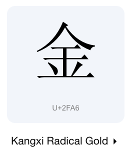
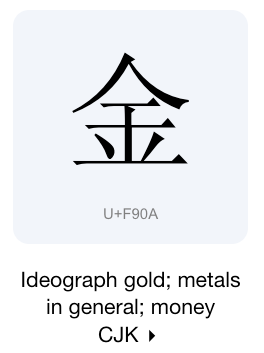

# Unicode相似字符攻击

## 攻击原理

Unicode 相似字符攻击是一种利用 Unicode 字符集中存在的字符相似性来绕过文本过滤或识别系统的攻击手段。攻击者通过使用看似相同但实际上具有不同 Unicode 编码的字符来欺骗系统，以达到绕过过滤器或识别系统的目的。这种攻击可以用于欺诈、钓鱼、恶意代码注入等各种恶意活动中。

**原理：**

1. **Unicode 字符集的复杂性**：Unicode 字符集非常庞大，包含了数千个字符，其中很多字符在外观上看起来非常相似或者完全一样，但实际上它们的 Unicode 编码是不同的。这种复杂性使得攻击者可以利用这些相似字符来绕过文本过滤或识别系统的检测。
2. **字符规范化的差异**：Unicode 规范定义了多种字符规范化形式，比如 NFC、NFD、NFKC、NFKD 等，它们会对字符进行不同程度的归一化处理。攻击者可以利用不同的字符规范化形式来生成看似相同但实际上具有不同 Unicode 编码的字符。

**外形一致不同点位文字演示**

例如下面两个 [“金”](https://symbl.cc/en/unicode-table/#cjk-compatibility-ideographs) 和 [“⾦”](https://symbl.cc/en/unicode-table/#cjk-radicals-supplement) 字的比较，虽然肉眼看起来外形一致，但是再 unicode 中确是不同的点位。




```go
package main

import (
   "fmt"
   "unicode/utf8"
)
func main() {
	s := "金"
	r, _ := utf8.DecodeRuneInString(s)
	fmt.Printf("Unicode 十六进制格式码点编码：%U\n", r)

	s2 := "⾦"
	r2, _ := utf8.DecodeRuneInString(s2)
	fmt.Printf("s2 Unicode 十六进制格式码点编码：%U\n", r2)
}

// 输出内容
// Unicode 十六进制格式码点编码：U+F90A
// s2 Unicode 十六进制格式码点编码：U+2FA6
```

**UTF-8中文字符Unicode码点范围**

Unicode CJK 的范围分布在多个区段中，带有 CJK 的区块名中都拥有汉字。但最常用的范围是 `U+4E00～U+9FA5`，即名为：CJK Unified Ideographs 的区块，但 U+9FA6～U+9FFF 之间的字符还属于空码，暂时还未定义，但不能保证以后不会被定义。
包括来自中文、日文、韩文、越南文、壮文、琉球文中的汉字，还包括越南的喃字与儒字、方块壮字，未来还包括甲骨文、金文、简帛文、陶文、鸟虫书等。

- 注1：中文范围 4E00-9FBF：CJK 统一表意符号 (CJK Unified Ideographs)
- 注2：正则表达式[\u4e00-\u9fa5] 可匹配中文字符，但这种方式并不能根据平台所提供的字符集范围不同而改变。
- 注3：Unicode 中 U+4E00～U+9FFF 的码表：http://www.unicode.org/charts/PDF/U4E00.pdf

**汉字Unicode编码范围**

对于不属于 `U+4E00～U+9FA5` 范围的字符，则是需要我们防止unicode相似字符攻击思考的地方。

| **字符集中文名**                                                 | **字数** | **Unicode 编码** |
|-------------------------------------------------------------------------| -------- | ---------------- |
| [基本汉字](https://www.qqxiuzi.cn/zh/hanzi-unicode-bianma.php?zfj=jbhz)     | 20902字  | 4E00-9FA5        |
| [基本汉字补充](https://www.qqxiuzi.cn/zh/hanzi-unicode-bianma.php?zfj=jbhzbc) | 90字     | 9FA6-9FFF        |
| [扩展A](https://www.qqxiuzi.cn/zh/hanzi-unicode-bianma.php?zfj=kza)       | 6592字   | 3400-4DBF        |
| [扩展B](https://www.qqxiuzi.cn/zh/hanzi-unicode-bianma.php?zfj=kzb)       | 42720字  | 20000-2A6DF      |
| [扩展C](https://www.qqxiuzi.cn/zh/hanzi-unicode-bianma.php?zfj=kzc)       | 4154字   | 2A700-2B739      |
| [扩展D](https://www.qqxiuzi.cn/zh/hanzi-unicode-bianma.php?zfj=kzd)       | 222字    | 2B740-2B81D      |
| [扩展E](https://www.qqxiuzi.cn/zh/hanzi-unicode-bianma.php?zfj=kze)       | 5762字   | 2B820-2CEA1      |
| [扩展F](https://www.qqxiuzi.cn/zh/hanzi-unicode-bianma.php?zfj=kzf)       | 7473字   | 2CEB0-2EBE0      |
| [扩展G](https://www.qqxiuzi.cn/zh/hanzi-unicode-bianma.php?zfj=kzg)       | 4939字   | 30000-3134A      |
| [扩展H](https://www.qqxiuzi.cn/zh/hanzi-unicode-bianma.php?zfj=kzh)       | 4192字   | 31350-323AF      |
| [扩展I](https://www.qqxiuzi.cn/zh/hanzi-unicode-bianma.php?zfj=kzi)       | 622字    | 2EBF0-2EE5D      |
| [康熙部首](https://www.qqxiuzi.cn/zh/hanzi-unicode-bianma.php?zfj=kxbs)     | 214字    | 2F00-2FD5        |
| [部首扩展](https://www.qqxiuzi.cn/zh/hanzi-unicode-bianma.php?zfj=bskz)     | 115字①   | 2E80-2EF3        |
| [兼容汉字](https://www.qqxiuzi.cn/zh/hanzi-unicode-bianma.php?zfj=jrhz)     | 472字②   | F900-FAD9        |
| [兼容扩展](https://www.qqxiuzi.cn/zh/hanzi-unicode-bianma.php?zfj=jrkz)     | 542字    | 2F800-2FA1D      |
| [汉字笔画](https://www.qqxiuzi.cn/zh/hanzi-unicode-bianma.php?zfj=hzbh)     | 36字     | 31C0-31E3        |
| [汉字结构](https://www.qqxiuzi.cn/zh/hanzi-unicode-bianma.php?zfj=hzjg)     | 16字     | 2FF0-2FFF        |
| [汉语注音](https://www.qqxiuzi.cn/zh/hanzi-unicode-bianma.php?zfj=hyzy)     | 43字     | 3105-312F        |
| [注音扩展](https://www.qqxiuzi.cn/zh/hanzi-unicode-bianma.php?zfj=zykz)     | 32字     | 31A0-31BF        |
| 〇                                                                       | 1字      | 3007             |

Unicode 版本：15.1

字数备注:
① 部首扩展：2E9A 是空码位。
② 兼容汉字：FA6E、FA6F 是空码位。

此页面的字数按实际字数标示（排除空码位），编码范围则排除了首尾空码位。另一个页面《[世界文字大全](https://www.qqxiuzi.cn/zh/unicode-zifu.php)》的编码范围标注则与 Unicode 一致（包括空码位）。 另，原有 PUA 字符产生于上世纪九十年代，现已全部标准化拥有正式码位，故从表中删除。

**形成过程：**

1. **拉丁字符和特殊符号的混合**：攻击者可以将拉丁字符（比如英文字母）与一些看似相似的特殊符号（比如希腊字母、数学符号等）混合在一起，生成一个看起来和原始字符相似但实际上具有不同编码的字符。例如，使用希腊字母的小写 sigma（σ）替代拉丁字母的小写 s（s）。
2. **全角和半角字符的混合**：攻击者可以利用全角字符（全角空格、全角标点等）和半角字符（英文字符、标点符号等）的外观相似性来混合使用，生成绕过过滤器的字符。例如，使用全角字符的英文句号（。）替代半角字符的英文句号（.）。
3. **Unicode 组合字符的利用**：Unicode 支持字符的组合表示，攻击者可以利用组合字符来生成看似相同但实际上具有不同编码的字符。例如，使用拉丁字母和组合重音符号（combining acute accent）来生成特定语言的字符，绕过过滤器检测。

通过利用这些技巧，攻击者可以成功地绕过文本过滤或识别系统的检测，传播有害内容或实施其他恶意活动。因此，对于开发文本过滤或识别系统的人员来说，需要认识到 Unicode 相似字符攻击的潜在风险，并采取相应的防御措施来保护系统的安全。

## 解决方案

防止 Unicode 相似字符攻击是敏感词检测中的一个重要问题，因为攻击者可以利用这些字符来绕过过滤器，传播有害内容或攻击目标。以下是一些防范措施：

1. **字符归一化（Normalization）**：将输入的文本进行字符归一化处理，将不同形式的 Unicode 字符统一成同一种形式，从而减少相似字符的影响。Unicode 规范定义了几种不同的归一化形式（Normalization Forms），比如 NFC、NFD、NFKC、NFKD，可以根据具体需求选择合适的归一化方式。
2. **白名单验证**：限制用户输入只能包含特定的字符集合，而不是接受任意字符。可以定义一个白名单，只允许合法字符通过过滤器。
3. **规则匹配**：建立一套严格的规则来检测和匹配潜在的相似字符攻击。这些规则可以基于字符的视觉相似性、Unicode 编码的相似性等。
4. **黑名单过滤**：维护一个黑名单，包含已知的相似字符及其对应的正常字符。当检测到输入中包含黑名单中的字符时，可以将其替换或过滤掉。
5. **用户教育**：向用户提供教育，让他们意识到利用相似字符来规避过滤器是不道德的行为，并鼓励他们使用正常的字符输入。
6. **多种检测手段结合**：使用多种不同的技术和方法结合起来，提高检测的准确性和鲁棒性，从而有效地防止相似字符攻击。

综合使用以上策略，可以在敏感词检测中有效地防止相似字符攻击。然而，需要注意的是，安全性是一个持续的过程，需要不断地更新和改进防御措施，以适应不断变化的威胁和攻击手法。

**NFKC和NFKD的区别**

NFKC 和 NFKD 是 Unicode 字符串的两种归一化形式，它们之间的主要区别在于归一化的方式和处理范围：

1. **NFKC（Normalization Form KC）**：
    - 这种形式是 Unicode 归一化的一种形式，其中“K”表示兼容（compatibility）。
    - NFKC 形式会尽可能地将字符转换为兼容的形式，以便更容易地比较和匹配字符串。它执行的归一化操作包括将一些特殊字符转换为等效的普通字符，比如把全角标点转换成半角标点，把特殊的组合字符转换为对应的单一字符，等等。
    - NFKC 形式会保留字符的兼容性，因此在某些情况下可能会导致字符的损失或变化，但通常会更适合用于搜索、比较和匹配等操作。

2. **NFKD（Normalization Form KD）**：
    - 这种形式也是 Unicode 归一化的一种形式，其中“K”表示兼容（compatibility），“D”表示分解（decomposition）。
    - NFKD 形式会将字符分解为其组成部分，即将组合字符拆分为基字符和重音。这种形式更进一步，对于某些特殊字符，会将其转换为更基本的形式。
    - NFKD 形式会尽量消除字符的兼容性，即使在某些情况下会导致字符的丢失或变化。这种形式适用于一些特定场景，如文本标准化、索引化等。

总的来说，NFKC 和 NFKD 形式在处理 Unicode 字符串时，NFKC 更注重于保留字符的兼容性和整体可读性，而 NFKD 则更注重于字符的分解和简化。如果你需要进行搜索、比较或匹配操作，那么 NFKC 形式可能更适合；而如果你需要进行文本标准化或分析等操作，那么 NFKD 形式可能更为合适。

## Go代码实现

**归一化处理**
```go
import (
	"fmt"
	"golang.org/x/text/unicode/norm"
)

func main() {
	// 原始字符串
	original := "㋅"
	targetStr := "6月"
	fmt.Println("原始字符串：", original)
	fmt.Println("目标字符串：", targetStr)

	// NFC 形式（由组合字符组成）
	nfc := norm.NFC.String(original)
	fmt.Println("NFC 形式：", nfc)

	// NFD 形式（由基字符和重音分开）
	nfd := norm.NFD.String(original)
	fmt.Println("NFD 形式：", nfd)

	// 【推荐】 NFKC 形式（合成后的形式，且兼容 ASCII）
	nfkc := norm.NFKC.String(original)
	fmt.Println("NFKC 形式：", nfkc)

	// NFKD 形式（分解后的形式，且兼容 ASCII）
	nfkd := norm.NFKD.String(original)
	fmt.Println("NFKD 形式：", nfkd)

	// 判断目标字符串
	res0 := original == targetStr
	fmt.Println("原始和目标字符串比较", res0)

	res1 := nfkc == targetStr
	fmt.Println("NFKC字符串比较", res1)

	res2 := nfkd == targetStr
	fmt.Println("NFKD字符串比较", res2)
}
```